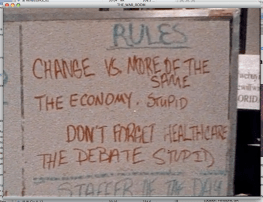

# Who Am I?

:::{fragment}
The best way to reach me: `philipp_jonas.kreutzer@ekh.lu.se`
:::

# Who are you?

:::{notes}
- I understand ecology.
- I like ecology.
- I trust ecology.
  
- I understand economics.
- I like economics.
- I trust economics.
:::

# What to expect of this course {.inverted}

## 

:::{notes}
open question what is the economy to you?
:::

oikos---house
root of both ecology and economy

image of embeddedness
pillars

