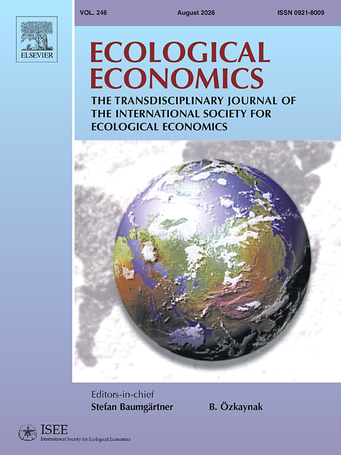
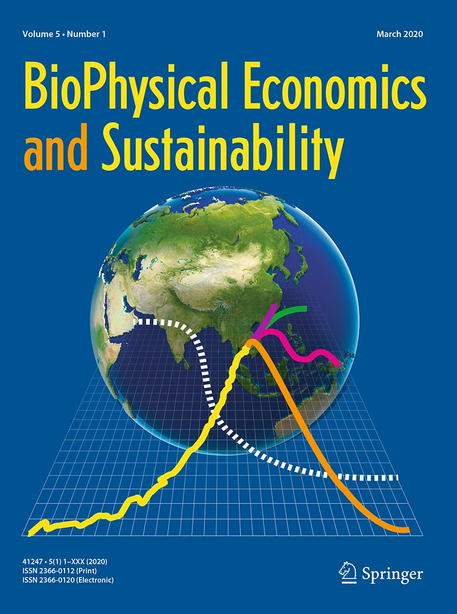

# Learning Objectives

::: {.callout-tip}

## By the end of today's lecture you should:

1. Be able to outline ecological economics as a field of teaching and research
2. Be able to list different economic fields and analyze the extent to which they represent mainstream thoughts
3. Be able to evaluate different streams within ecological economics regarding their relation to mainstream economics

:::

# What is Ecological Economics? {.inverted}

## Ecological Economics as the interaction between Ecology and Economics

:::{.notes}
@spash2018RoutledgeHandbookEcological is very critical in his view of mainstream economics.

On what basis does he propose the need for ecological economics?

There were a lot of potentially new words and concepts in the chapter. Where there any you struggled with?

- commodity
- price-making market
- macro- and microeconomics
- social-metabolism
- neoliberalism
- comparative advantage
- utilitarianism
- opportunity costs

:::

***

### Ecological Economics Place in Economics

](../assets/exploring-economics.png){#fig-exploring-economics}

***

### Major Journals

::: {.columns}

::: {.column width="50%"}

{#fig-ee-cover width=90%}

:::

::: {.column width="33%"}

{#fig-biophysical-cover} 

:::

:::

### Three different approaches to ecological economics

## The core tension: how do we overcome the mainstream economic paradigm?

# Checking-in on Learning Objectives

::: {.callout-tip}

## By the end of today's lecture you should:

1. Be able to outline ecological economics as a field of teaching and research
2. Be able to list different economic fields and analyze the extent to which they represent mainstream thoughts
3. Be able to evaluate different streams within ecological economics regarding their relation to mainstream economics

:::

## References