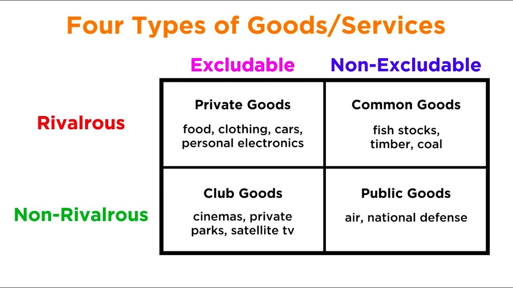

# Learning Objectives

::: {.callout-tip}

## By the end of today's lecture you should:

1. Be able to outline ecological economics as a field of teaching and research
2. Be able to list different economic fields and analyze the extent to which they represent mainstream thoughts
3. Be able to evaluate different streams within ecological economics regarding their relation to mainstream economics

:::

# Principles {.inverted}

## Ecological Economics embeds the economy in society and society in the environment

:::{.notes}
Draw different images of economy, society, and ecology.
:::

## Full-World Economics

:::{.notes}
draw image of full world and exchange with universe

{width=50%}
:::

***

### How many economists think about provisioning: Cobb-Douglas Production Function

A combination of three "production factors"

$$\color{purple}{Y} = \color{red}{A} \cdot \color{blue}{K}^{\color{blue}{\alpha}} \cdot \color{teal}{L}^{\color{teal}{1-\alpha}}$$

With:

$$\color{red}{A} = \text{Productivity}, \quad \color{blue}{K} = \text{capital}, \quad \color{teal}{L} = \text{labor}, \quad \color{blue}{\alpha} + \color{teal}{(1-\alpha)} = 1$$


## Building some intuition for the Cobb-Douglas production function

```{=html}
<div id="cd-widget" style="font-family: system-ui; max-width: 640px; margin: 0 auto; padding: 1em 1.5em; background: #f7f7f7; border-radius: 10px;">
  <div style="font-size: 1.8em; text-align: center; margin-bottom: 0.6em;">
    <span style="color:purple;">Y</span> =
    <span style="color:red;">A</span> ·
    <span style="color:blue;">K</span><sup style="color:blue;">α</sup> ·
    <span style="color:teal;">L</span><sup style="color:teal;">1−α</sup>
  </div>
  <div style="display: grid; grid-template-columns: 2em 1fr 3.5em; gap: 0.4em 1em; align-items: center; font-size: 0.9em;">
    <label style="color:blue;">K</label>
    <input type="range" min="0" max="100" value="50" id="cd-k">
    <span id="cd-k-val" style="color:blue; font-variant-numeric: tabular-nums;">50</span>

    <label style="color:teal;">L</label>
    <input type="range" min="0" max="100" value="50" id="cd-l">
    <span id="cd-l-val" style="color:teal; font-variant-numeric: tabular-nums;">50</span>

    <label>α</label>
    <input type="range" min="0.05" max="0.95" step="0.05" value="0.3" id="cd-alpha">
    <span id="cd-alpha-val" style="font-variant-numeric: tabular-nums;">0.30</span>

    <label style="color:red;">A</label>
    <input type="range" min="0.5" max="3" step="0.1" value="1" id="cd-a">
    <span id="cd-a-val" style="color:red; font-variant-numeric: tabular-nums;">1.0</span>
  </div>
  <div style="text-align: center; font-size: 1.8em; margin-top: 0.7em;">
    <span style="color:purple;">Y</span> =
    <span id="cd-y" style="color:purple; font-weight: bold; font-variant-numeric: tabular-nums;">50.00</span>
  </div>
</div>

<script>
(function() {
  const w = document.getElementById('cd-widget');
  const k = w.querySelector('#cd-k'), l = w.querySelector('#cd-l'),
        a = w.querySelector('#cd-a'), al = w.querySelector('#cd-alpha');
  function update() {
    const K = +k.value, L = +l.value, A = +a.value, alpha = +al.value;
    const Y = A * Math.pow(K, alpha) * Math.pow(L, 1 - alpha);
    w.querySelector('#cd-k-val').textContent = K;
    w.querySelector('#cd-l-val').textContent = L;
    w.querySelector('#cd-a-val').textContent = A.toFixed(1);
    w.querySelector('#cd-alpha-val').textContent = alpha.toFixed(2);
    w.querySelector('#cd-y').textContent = Y.toFixed(2);
  }
  [k, l, a, al].forEach(el => el.addEventListener('input', update));
  update();
})();
</script>
```

## Criticism from @georgescu-roegen1975EnergyEconomicMyths

## Strong versus Weak Sustainability

:::{.notes}
What do @costanza2015IntroductionEcologicalEconomics say on the substitutability of capital?

Can you find examples where natural capital can be substituted by other forms of capital?

Can you find examples where it cannot?
:::


# Appendix {.inverted}

## Types of goods 

:::{.notes}

:::

## Ecosystem Services 

::: {.columns}

::: {.column}

{#fig-eco-service-types}

:::

::: {.column .fragment}

{#fig-eco-service-example}


:::

:::

