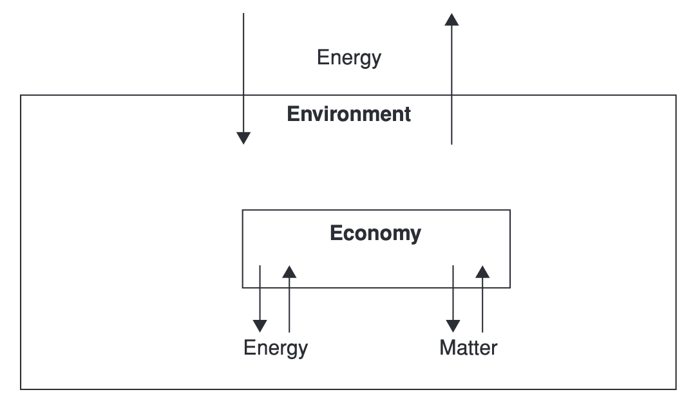
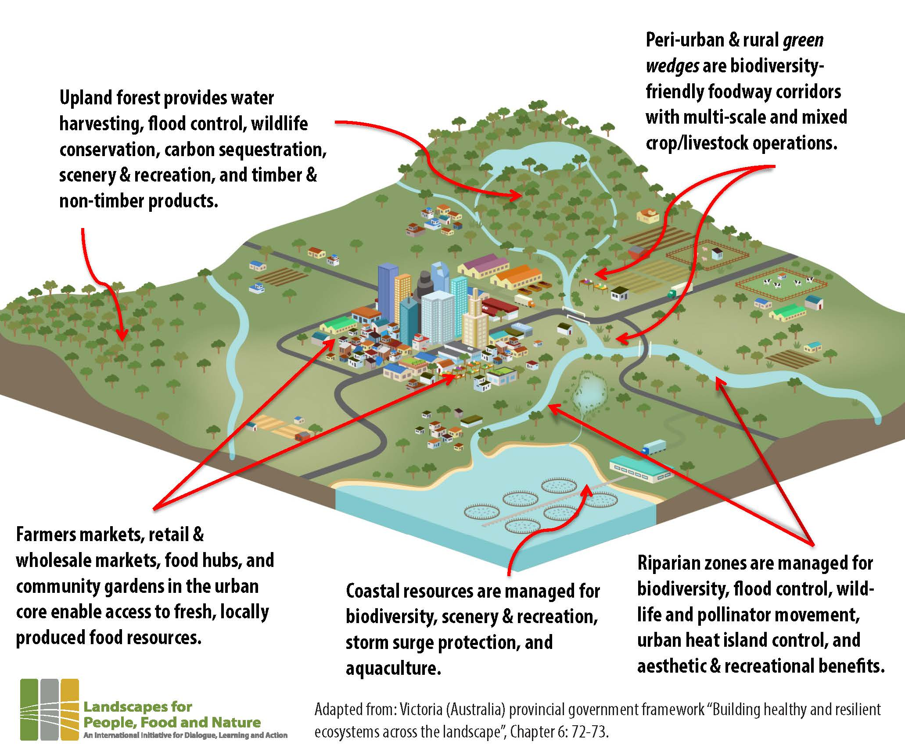
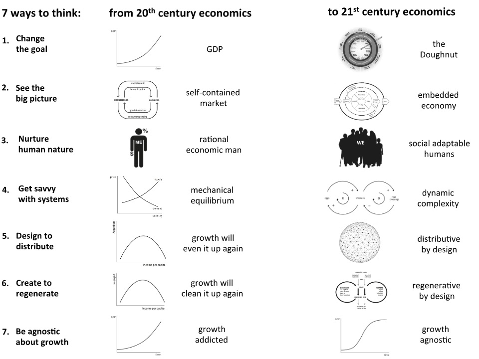

# Learning Objectives

::: {.callout-tip}

## By the end of today's lecture you should:

1. Be able to describe how ecological economics relates economic, ecological, and social systems
2. Be able to list ways in which ecological economics challenges mainstream economic thinking
3. Be able to criticize mainstream approaches to value nature from the perspective of strong sustainability

:::

# Principles {.inverted}

## Ecological Economics embeds the economy in society and society in the environment

:::{.notes}
Draw different images of economy, society, and ecology.
:::


## Empty World

![Stylistic Image of Empty World Economics copied from @costanza2015IntroductionEcologicalEconomics [p.159]](../assets/empty-world.png){#fig-empty-world}

## How many economists think about provisioning: Cobb-Douglas Production Function

A combination of three "production factors"

$${\color{#2b3a67}{Y}} = {\color{#e53e3e}{A}} \cdot {\color{#3b6de0}{K}}^{{\color{#3b6de0}{\alpha}}} \cdot {\color{#519872}{L}}^{{\color{#519872}{1-\alpha}}}$$

With:

$${\color{#e53e3e}{A}} = \text{Productivity}, \quad {\color{#3b6de0}{K}} = \text{capital}, \quad {\color{#519872}{L}} = \text{labor}, \quad {\color{#3b6de0}{\alpha}} + {\color{#519872}{(1-\alpha)}} = 1$$


## Building some intuition for the Cobb-Douglas production function

```{=html}
<div id="cd-widget" style="font-family: system-ui; max-width: 640px; margin: 0 auto; padding: 1em 1.5em; background: #f7f7f7; border-radius: 10px;">
  <div style="font-size: 1.8em; text-align: center; margin-bottom: 0.6em;">
    <span style="color:#2b3a67;">Y</span> =
    <span style="color:#e53e3e;">A</span> ·
    <span style="color:#3b6de0;">K</span><sup style="color:#3b6de0;">α</sup> ·
    <span style="color:#519872;">L</span><sup style="color:#519872;">1−α</sup>
  </div>
  <div style="display: grid; grid-template-columns: 2em 1fr 3.5em; gap: 0.4em 1em; align-items: center; font-size: 0.9em;">
    <label style="color:#3b6de0;">K</label>
    <input type="range" min="0" max="100" value="50" id="cd-k">
    <span id="cd-k-val" style="color:#3b6de0; font-variant-numeric: tabular-nums;">50</span>

    <label style="color:#519872;">L</label>
    <input type="range" min="0" max="100" value="50" id="cd-l">
    <span id="cd-l-val" style="color:#519872; font-variant-numeric: tabular-nums;">50</span>

    <label>α</label>
    <input type="range" min="0.05" max="0.95" step="0.05" value="0.3" id="cd-alpha">
    <span id="cd-alpha-val" style="font-variant-numeric: tabular-nums;">0.30</span>

    <label style="color:#e53e3e;">A</label>
    <input type="range" min="0.5" max="3" step="0.1" value="1" id="cd-a">
    <span id="cd-a-val" style="color:#e53e3e; font-variant-numeric: tabular-nums;">1.0</span>
  </div>
  <div style="text-align: center; font-size: 1.8em; margin-top: 0.7em;">
    <span style="color:#2b3a67;">Y</span> =
    <span id="cd-y" style="color:#2b3a67; font-weight: bold; font-variant-numeric: tabular-nums;">50.00</span>
  </div>
</div>

<script>
(function() {
  const w = document.getElementById('cd-widget');
  const k = w.querySelector('#cd-k'), l = w.querySelector('#cd-l'),
        a = w.querySelector('#cd-a'), al = w.querySelector('#cd-alpha');
  function update() {
    const K = +k.value, L = +l.value, A = +a.value, alpha = +al.value;
    const Y = A * Math.pow(K, alpha) * Math.pow(L, 1 - alpha);
    w.querySelector('#cd-k-val').textContent = K;
    w.querySelector('#cd-l-val').textContent = L;
    w.querySelector('#cd-a-val').textContent = A.toFixed(1);
    w.querySelector('#cd-alpha-val').textContent = alpha.toFixed(2);
    w.querySelector('#cd-y').textContent = Y.toFixed(2);
  }
  [k, l, a, al].forEach(el => el.addEventListener('input', update));
  update();
})();
</script>
```

## Full-World Economics

:::{.notes}
draw image of full world and exchange with universe

{width=50%}
:::


## Criticism from @georgescu-roegen1975EnergyEconomicMyths

:::{.notes}
funds (capital, labor, land) are what we use to transform the flows (matter, energy) passing through. The funds themselves don't disappear in the act of production. The flows do.
:::

## Strong versus Weak Sustainability

:::{.notes}
What do @costanza2015IntroductionEcologicalEconomics say on the substitutability of capital?

Can you find examples where natural capital can be substituted by other forms of capital?

Can you find examples where it cannot?
:::

*** 
### Ecosystem services revisited


::: {.columns}

::: {.column}

{#fig-eco-service-types}

:::

::: {.column .fragment}

{#fig-eco-service-example}


:::

:::


## Scale, distribution, and allocation

:::{.notes}
Image of a ship:

allocation is how we arrange containers
distribution is how we decide whose containers
scale is how we decide how many containers are possible

:::

## Seven ways to think like an Ecological Economist

{#fig-seven-ways}


# Checking-in on Learning Objectives

::: {.callout-tip}

## By the end of today's lecture you should:

1. Be able to describe how ecological economics relates economic, ecological, and social systems
2. Be able to list ways in which ecological economics challenges mainstream economic thinking
3. Be able to criticize mainstream approaches to value nature from the perspective of strong sustainability

:::

# References

