# Learning Objectives

::: {.callout-tip}
## By the end of today's lecture you should:
1. Be able to list the main historical figures that have shaped ecological and mainstream economics
2. Be able to understand key economic ideas to describe human use of nature and differentiate them based on their historical origins
3. Be able to create requirements for new economic theories based on ecological insights
:::

# Classical Economics {.inverted}

Economics grows out of moral philosophy
1750--1870

## The economy as flow from nature

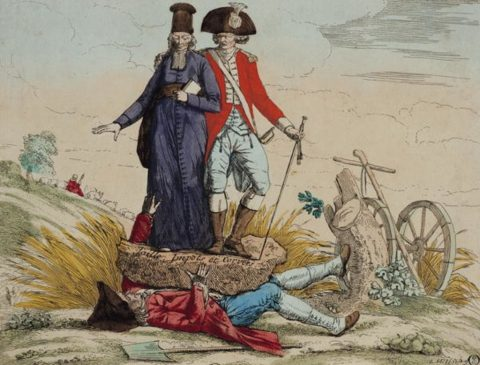{fig-align=bottom width="100%"}

## The economy as flow from nature

::: {.columns}

::: {.column width=25%}

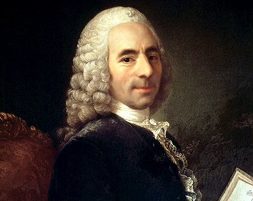{fig-align=bottom width="100%"}

:::

::: {.column width=75% .fragment}

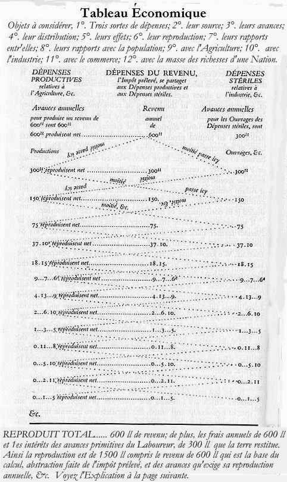{ width="50%"}

:::

:::

::: aside
François Quesnay & the Physiocrats, mid-18th c. France
:::

::: notes
**Concept to land:** the economy as a *system of flows* originating in nature.

:::

## The Wealth of Nations: Gold or People?

## The Wealth of Nations: Gold or People?

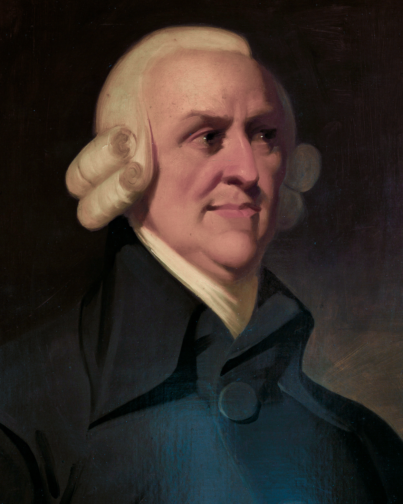{fig-align="center" width="35%"}

> It is not from the benevolence of the butcher, the brewer, or the baker, that we expect our dinner, but from their regard to their own interest.

::: aside
Smith, *Wealth of Nations* (1776), Bk I, Ch. II
:::
::: notes

**Concept to land:** productivity comes from specialization — but in shifting attention there, Smith starts the long process of taking nature for granted.

:::

## The first model of limits

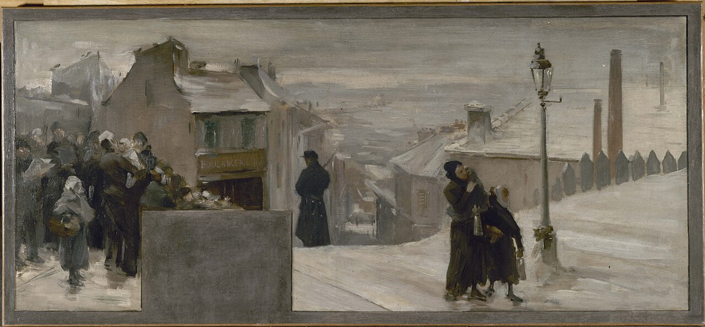

## The first model of limits

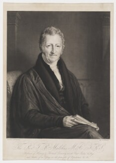{fig-align="center" width="35%"}

> Population, when unchecked, increases in a geometrical ratio. Subsistence increases only in an arithmetical ratio.

::: aside
Malthus, *Essay on the Principle of Population* (1798), Ch. 1
:::

::: notes
**Concept to land:** carrying capacity — exponential demand running into linear supply. The first formal model of biophysical limits in economics.

**Board sketch:** two curves on the same axes (population vs. time). One straight rising line (food). One exponential curve (population). Where they cross, draw a dashed line — Malthus's "positive checks": famine, disease, war.

**Talking points:**
- Malthus's problem: late 18th-century England, urbanizing, Poor Laws debate, fear of post-French-Revolution unrest
- Argument: human reproductive drive is structurally faster than agricultural output growth
- Policy implication he drew: Poor Laws subsidize reproduction, making the problem worse. He was a conservative.
- He's the first economist to take *limits* as a structural feature, not a temporary inconvenience
- He was also wrong about the next 200 years
Source: Malthus 1798

:::

## Rent and the marginal-land logic

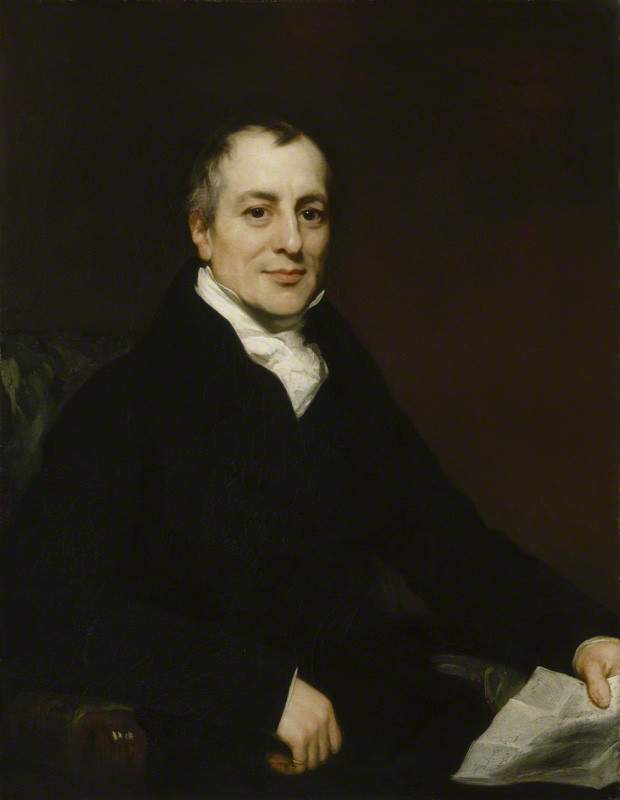{fig-align="center" width="35%"}

> Rent is paid to the landlord for the use of the original and indestructible powers of the soil.

::: aside
Ricardo, *Principles of Political Economy and Taxation* (1817), Ch. II
:::

::: notes
**Concept to land:** *rent* — what owners earn for nothing — and the structural logic of extracting from progressively worse-quality resources.

**Board model — Ricardo's rent:**

1. Axes: x = land area cultivated (best on the left, worst on the right); y = labor required per unit of food
2. Step function: low labor on best land, jumps up as worse land is added
3. Population grows → cultivation extends rightward onto less fertile soil ("extensive margin")
4. Food price rises to cover labor on the worst land in use
5. On the *best* land, labor is still low — owners pocket the difference. That's rent.
6. Higher prices also push more labor onto good land — fertilizer, irrigation, pesticides ("intensive margin")

**Why this concept travels:**
- Petroleum geologists use the same logic: best fields first, then progressively worse ones
- Mineral economics, fishery economics, soil quality — same structure
- The "intensive margin" maps onto industrial agriculture's pesticide and fertilizer trajectory
- Henry George (1879) asked the obvious distributive question — why should anyone earn rent for doing nothing? He proposed a land-value tax. 

:::

## The stationary state

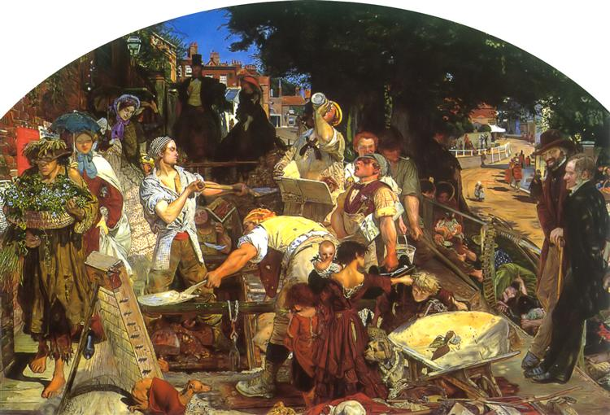

## The stationary state

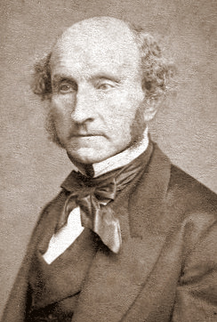{fig-align="center" width="35%"}

> A stationary condition of capital and population implies no stationary state of human improvement.

::: aside
Mill, *Principles of Political Economy* (1848), Bk IV, Ch. VI, §2
:::

::: notes
**Concept to land:** *stationary state* — a society can stop growing in scale and keep developing in quality. The proto-steady-state idea, dormant for 120 years before Daly revives it.

**Talking points (one of the most important slides in the first half — comes back as Daly):**
- By 1848 the classical economists were converging on the conclusion that growth would slow as land scarcity bit. Most treated this as tragedy.
- Mill said: actually, that might be fine. A society could stop growing in *scale* and keep growing in *quality* — culture, art, science, leisure, equality.
- Read more if there's time: "I confess I am not charmed with the ideal of life held out by those who think that the normal state of human beings is that of struggling to get on..." (same chapter)
- Mill is also the figure who wanted to separate political economy from natural science — "the laws of the mind, not the laws of matter" (Raworth's gloss). So he both opens and closes a door.
:::

## The metabolic rift

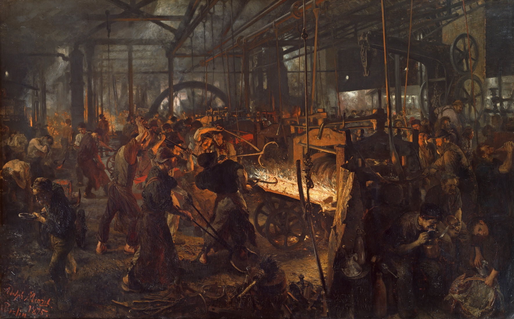

## The metabolic rift

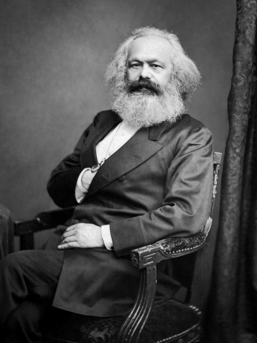{fig-align="center" width="35%"}

> Capitalist production... disturbs the metabolic interaction between man and the earth.

::: aside
Karl Marx, Capital, vol. 1 (London: Penguin, 1976), 637–38
:::

::: notes

**Concept to land:** *metabolic rift* — capitalist agriculture extracts nutrients from the soil and ships them to cities, where they end up in sewers rather than fields. The same structure that exploits labor exploits nature.

**Talking points:**
- Marx is the dissenting classical economist. He shared the labor theory of value with Smith and Ricardo but used it to attack rather than defend capitalism.
- *Stoffwechsel* in German — Marx was reading Liebig (the agricultural chemist) and saw the rural-urban nutrient flow as one-way
- This is John Bellamy Foster's reading of Marx (1999, 2000), which became a major thread in eco-Marxism
- Marx is the only classical economist who saw the *social-ecological* connection clearly: the way labor is exploited and the way nature is exploited share a structure

:::

## Three theories of value

::: {.columns}
::: {.column width="33%"}
**Land**

{width="60%"}

Physiocrats
:::
::: {.column width="33%"}
**Labor**

{fig-align="center" width="35%"}

{fig-align="center" width="35%"}

{fig-align="center" width="35%"}

Smith, Ricardo, Marx
:::
::: {.column width="33%"}
**Utility**

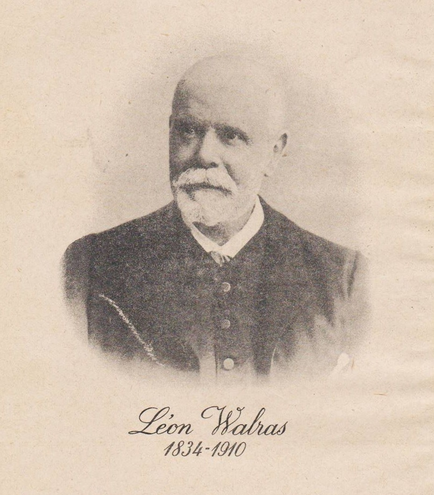{fig-align="center" width="35%"}

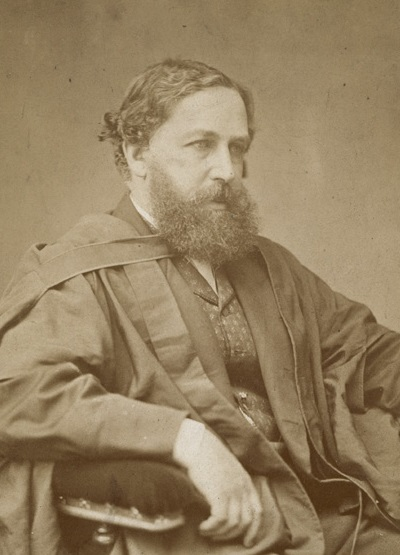{fig-align="center" width="35%"}

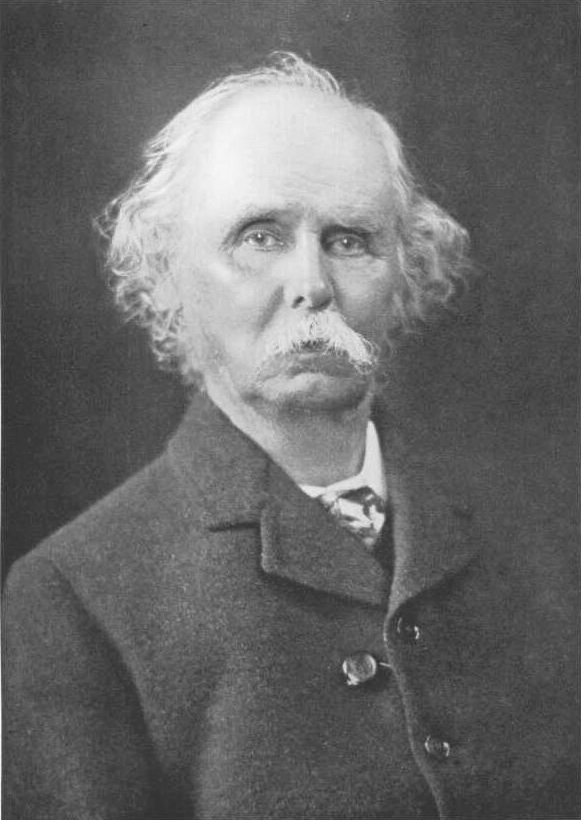{fig-align="center" width="35%"}

(coming next)
:::
:::

::: notes
**Concept to land:** what economists *count* as the source of value changes over time, and that choice has enormous consequences. 

**Talking points**
Where does the value of a thing come from? Three answers, three eras.

1. **Land theory of value** (Physiocrats). Value comes from nature's productive capacity. The earth grows things. Everything else is rearrangement.

2. **Labor theory of value** (Smith, Ricardo, Marx). Value comes from human work congealed in the product. A diamond is valuable because of the labor it took to find, mine, cut, and transport it. This carried classical economics from 1776 to about 1870.

3. **Utility theory of value** (the marginalists, after 1870). Value comes from human preference. A diamond is valuable because people are willing to pay for it. The substance and the labor disappear from the analysis.

Each shift has consequences. Note what disappears in the move from labor to utility:
- The materiality of the thing
- The conditions of its production
- The morality of who labored to make it

:::

# The "Marginal Revolution" {.inverted}

1870--1950

::: notes
~25 minutes. Three economists working independently in the 1870s — Jevons, Walras, Menger — pulled economics out of moral philosophy and made it a branch of mathematical physics. Five concepts will come out of this section: marginalism, equilibrium, externality, embedded economy, and the severance itself.
:::

## Physics envy and the utility move

::: {.columns}
::: {.column width="50%"}
{width="65%"}

> The Theory of Economy... presents a close analogy to the Science of Statical Mechanics.

::: aside
Jevons (1871), Preface
:::
:::
::: {.column width="50%"}
{width="65%"}

> The pure theory of economics... resembles the physico-mathematical sciences in every respect.

::: aside
Walras (1874), §30
:::
:::
:::

::: notes
**This is the consolidated marginalist-revolution slide — Jevons and Walras together, since they did the same move from different countries in the same decade.**

**Concept to land:** *marginalism* — the move that remade economics as a branch of mathematical physics, using utility maximization as its atom.

**Talking points:**
- 1870s: economics looked unscientific next to Newtonian physics. William Jevons (England), Leon Walras (Switzerland), and Karl Menger (Austria) all moved independently to fix this.
- The strategy: borrow the *mathematics* of physics (calculus, equilibrium) and apply it to human behavior
- They needed an "atom" of economics. They found it in Bentham's utility. Each person becomes a calculating machine maximizing pleasure, minimizing pain.
- Diminishing marginal utility — the more pineapples you have, the less you want one more — gives the curve they need
- Walras went further: a model of *all* markets simultaneously reaching equilibrium ("general equilibrium"). He didn't have the math; Arrow and Debreu finally proved it in 1954 and won the Nobel.
- The catch: the model requires extreme assumptions (perfect competition, perfect information, no externalities, complete markets). Real economies meet none of them.

:::

## Equilibrium

{fig-align="center" width="35%"}

> We might as reasonably dispute whether it is the upper or under blade of a pair of scissors that cuts a piece of paper.

::: aside
Marshall, *Principles of Economics* (1890), Bk V, Ch. III
:::

::: notes

**Concept to land:** market *equilibrium* visualized — the supply-demand cross. The diagram every economics student meets first, and the template that gets applied to everything from labor to love.

**Board model — supply and demand cross:**
1. Axes: x = quantity, y = price
2. Demand curve: downward-sloping (more pineapples → less utility per extra one)
3. Supply curve: upward-sloping (more pineapples → higher cost on the marginal unit)
4. Cross marks "market equilibrium" — quantity Q*, price P*
5. Note: this is *the* first diagram every economics student learns, more than 130 years later

**Talking points:**
- Marshall's *Principles* dominated for 50 years. He's the figure who *taught* the marginalist revolution to the 20th century.
- Scissors metaphor: neither supply nor demand alone determines price; they cross
- The pedagogical problem: a tool meant to be one analytic device became *the* template for thinking about everything — labor markets, environmental quality, even Becker's "marriage market"

Source: Marshall 1890; Raworth Ch.4
:::

## What faded away

1. Land
2. Materiality
3. Morality

## The externality patch

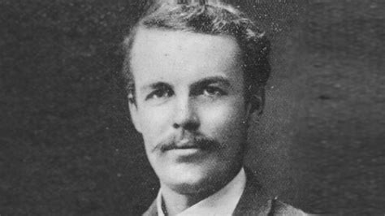{fig-align="center" width="35%"}

> One person A, in the course of rendering some service, for which payment is made,
to a second person B, incidentally also renders services or disservices to other persons . . ., of such a sort that payment cannot be exacted from the benefited parties
or compensation enforced on behalf of the injured parties

::: aside
Pigou, *The Economics of Welfare* (1932)
:::

::: notes

**Concept to land:** *externality* — the patch that environmental economics applies to keep the marginalist framework intact while accounting for pollution. Foundational for every carbon-tax proposal you'll ever see.

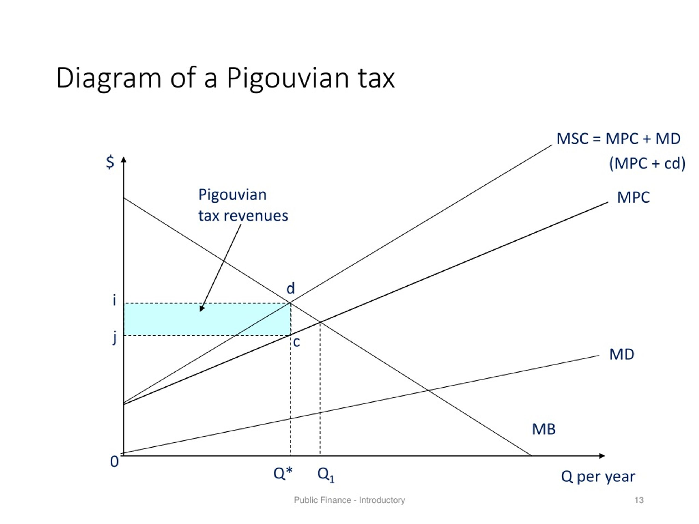

**Talking points:**
- Pigou's problem: by the 1910s it was obvious that markets generated harms — factory smoke, river pollution, urban squalor — that didn't show up in prices
- Fix: the *externality*. When a producer imposes costs on third parties without paying for them, the price is "wrong." The state can correct it with a tax.
- The "Pigouvian tax" is the ancestor of every carbon tax
- The structural point: Pigou *accepts* the marginalist framework and patches it. The market is the baseline; pollution is a deviation; the tax brings the market back to its theoretical optimum.
- Compare to ecological economics, which says: maybe the framework itself is the problem. Maybe putting a price on every "externality" misses the structural issue that the economy is embedded in a finite biosphere.
- Pigou is the founding father of *environmental economics* — the mainstream sub-discipline ecological economists distinguish themselves from.

Source: Pigou 1920
:::

# Re-entry of nature {.inverted}

1920s–1980

## From cowboy to spaceship

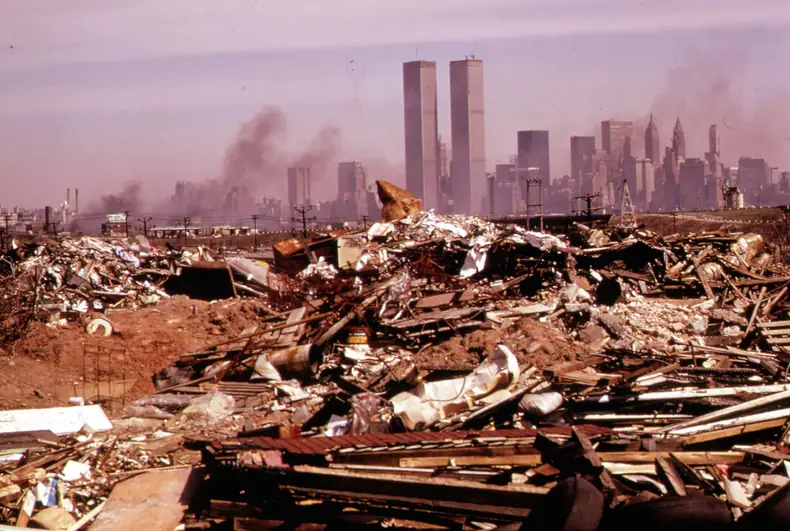

## From cowboy to spaceship

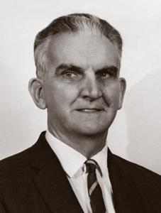{fig-align="center" width="35%"}

> Earth has become a single spaceship, without unlimited reservoirs of anything, either for extraction or for pollution.

::: aside
Boulding, "The Economics of the Coming Spaceship Earth" (1966)
:::

::: notes
**Concept to land:** the economy as an *open* vs. *closed* system. Mainstream economics implicitly assumes the cowboy version (infinite frontier in, infinite waste sink out). Reality is the spaceship version (closed biosphere, finite stocks, finite sinks).

**Board model — frontier vs. spaceship economy:**

Two boxes side by side.

*Cowboy*: a square labeled "economy" with arrows entering from the left (raw materials, infinite) and leaving to the right (waste, infinite). Open system.

*Spaceship*: a circle (the biosphere) containing a smaller square (the economy). The same arrows enter and leave the economy, but they cycle within the biosphere — which is closed.

**Talking points:**
- He was AEA president, no fringe figure. This is the first time a serious economist frames the economy as embedded in a finite biosphere.
- His problem: 1960s America, suburbanization, mass consumption, early environmental movement. *Silent Spring* (1962) was four years earlier.
- Apollo made "Spaceship Earth" thinkable. The Earthrise photo (1968) is two years after this essay.
- Aside on Soddy: Frederick Soddy made the same argument in 1922 (*Cartesian Economics*) — Nobel laureate in chemistry, ignored by economists for 50 years. Boulding rediscovered the insight.

:::

## The entropy law

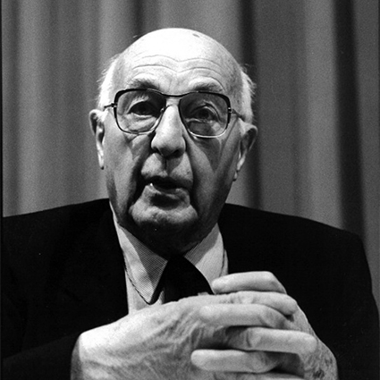{fig-align="center" width="35%"}

> Perhaps, the destiny of man is to have a short, but fiery, exciting and extravagant life rather than a long, uneventful and vegetative existence.

::: aside
Georgescu-Roegen (1971); cf. "Energy and Economic Myths" (1975)
:::

::: notes

**Concept to land:** the second law of thermodynamics applied to the economy. Production is one-way: low entropy in (concentrated, ordered energy and matter) → high entropy out (dispersed, disordered waste). New technology accelerates this; it does not reverse it.

:::

## Limits to Growth

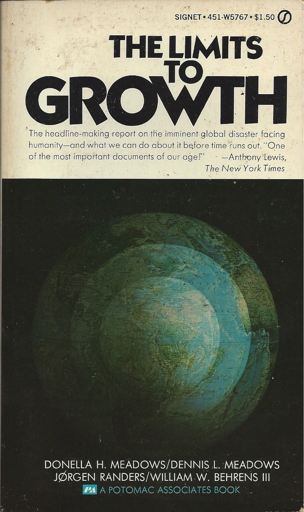{fig-align="center" width="35%"}

::: notes
**Concept to land:** *systems thinking* applied to the planet. Collapse is not caused by running out of any one thing — it's the result of feedbacks between resources, pollution, food, and population, with lags long enough that you don't see the limit until you've passed it.

**Talking points:**
- The Club of Rome commissioned MIT systems scientists (Donella Meadows, Dennis Meadows, Jørgen Randers, William Behrens) to model long-term human-earth interactions
- They built World3 — one of the first global system-dynamics computer models
- Standard run: business as usual leads to overshoot and collapse in the 21st century. Not a prediction; a *scenario*.
- They tested alternatives: more resources, better pollution control, smaller families. Most just delay collapse. Only the combination of *limits on consumption* and technological improvements avoids it.
- The book sold 30 million copies. Mainstream economics dismissed it as alarmist (Nordhaus published a snarky review). Forty years later, multiple groups have re-run World3 against actual data — the standard run tracks reality reasonably well so far (Turner 2008, Herrington 2021).
- The most influential ecological-economic document of the 20th century, and it didn't come from economists.

Source: Meadows et al. 1972; Turner 2008; Herrington 2021
:::

## The steady state, revived

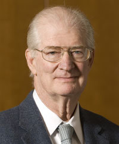{fig-align="center" width="35%"}

> Instead the economy is a subsystem of the finite biosphere that supports it.

::: aside
Daly, *A steady-state economy* (2008)
:::

::: notes

**Concept to land:** *throughput* and the steady state. Mill's question, given thermodynamic foundations and a 20th-century vocabulary. Distinguishes *growth* (more) from *development* (better).

:::

# Making a Neoliberal World{.inverted}

1947–today

## Markets as information

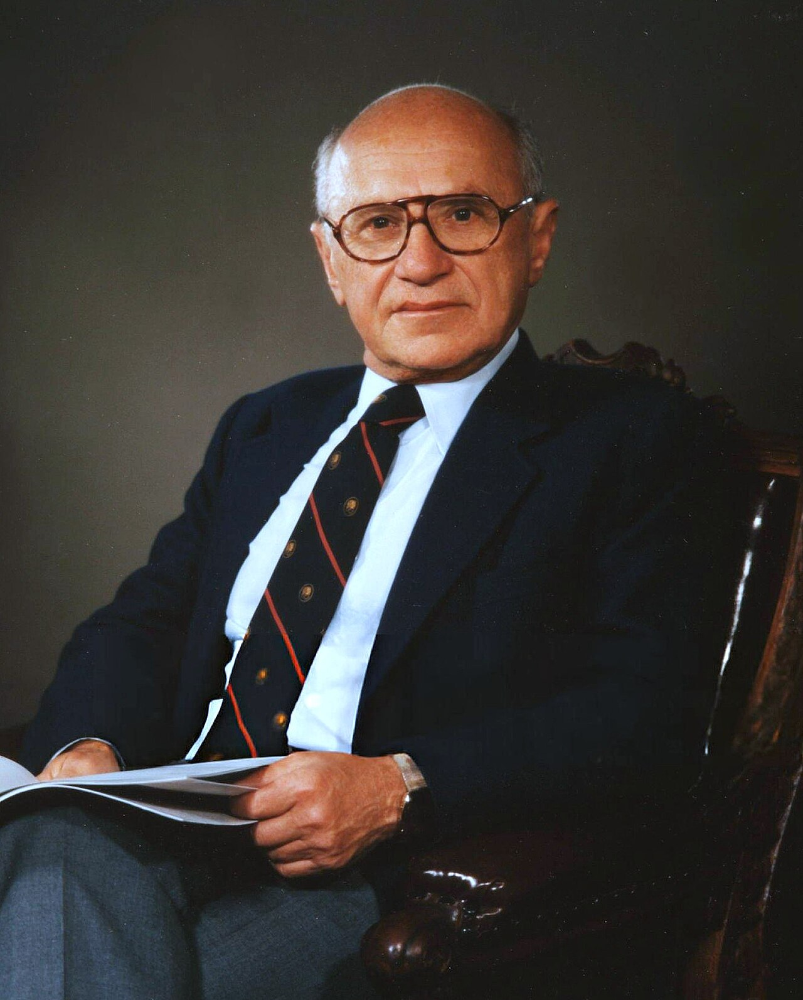{fig-align="center" width="35%"}

> Only a crisis — actual or perceived — produces real change. When that crisis occurs, the actions that are taken depend on the ideas that are lying around. That, I believe, is our basic function: to develop alternatives to existing policies, to keep them alive and available until the politically impossible becomes the politically inevitable.

::: aside
Friedman, *Capitalism and Freedom* (1982 [1962]), Preface
:::

::: notes
**Concept to land:** markets as *information-processing systems*. Genuinely a deep insight worth engaging with — not a strawman.

**Talking points:**
- Hayek's problem: 1930s and 40s, the rise of fascism and Stalinism. He saw central planning as the road to authoritarianism.
- Positive argument: markets aggregate dispersed knowledge. No central planner can know what millions of people want and need. The price system processes that information continuously.
- This is a real insight, and ecological economists should engage with it rather than dismiss it. Markets *do* process information well.
- The question is whether they process *all* the information that matters — especially long-term ecological information that doesn't show up in prices until it's too late.
- Hayek's normative move: from "markets are good at this specific thing" to "any non-market institution threatens freedom." That's a much bigger claim, and the one ecological economists need to push back on.

Source: Hayek 1944
:::

## Mont Pèlerin and the long game

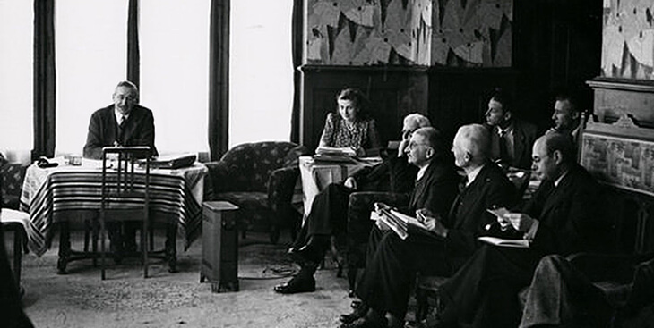{fig-align="center" width="55%"}

::: notes

**Concept to land:** ideas without institutions don't win political battles. The Mont Pèlerin network turned a defeated minority view into post-1980 orthodoxy through patient generational work. This is a *strategic* concept, not a theoretical one.

**Talking points:**
- 1947: Hayek convenes 39 intellectuals — Friedman, von Mises, Knight, Stigler, Popper — at Mont Pèlerin in Switzerland
- They saw themselves as a defeated minority. Keynesianism was triumphant. The post-war consensus was social-democratic.
- Their strategy was generational: build think tanks, train students, capture economics departments, wait for the next crisis
- Institute of Economic Affairs (1955), Heritage Foundation (1973), Cato Institute (1977) — all part of this network
- 1973: oil shock, stagflation. The Keynesian model fails to predict it. Friedman's monetarism is ready. Hayek wins the Nobel in 1974.
- 1979–80: Thatcher and Reagan. Mont Pèlerin program becomes policy.

The lesson:

Ecological economics had Boulding, Georgescu-Roegen, Daly, Meadows — brilliant theory. It didn't have think tanks, fellowships, donor networks, captured departments. When the climate crisis becomes acute enough that the orthodoxy breaks, *which set of ideas will be ready?*

This is the strategic question for their generation.

Source: Mirowski & Plehwe (eds.) *The Road from Mont Pèlerin* (2009); Klein, *The Shock Doctrine* (2007)
:::

# Where this leaves us {.inverted}

## Each toolkit answered the questions of its time

::: notes

**Talking points (~2 minutes):**

- Physiocrats: where does wealth come from in an agrarian society?
- Smith and Ricardo: how do industrial nations grow rich and trade?
- Malthus: what are the demographic limits of agriculture?
- Marx: who benefits and who pays in capitalism?
- Marginalists: how do we make economics rigorous and tractable?
- Pigou: how do we patch market failures?
- Boulding, G-R, Daly: what is the relationship between thermodynamics and the economy?
- Hayek and Friedman: how do we defend market society against planning?

None of these is the *wrong* question. Each was the right question at its moment.

**Our questions are different.** Climate. Biodiversity collapse. Inequality at planetary scale. Post-growth wellbeing. None of the figures we covered today designed their tools for these problems.

That's not a criticism of them. It's the work that needs doing now.
:::

## What should 21st-century economics deliver? {background-color="#e8e8f0"}

