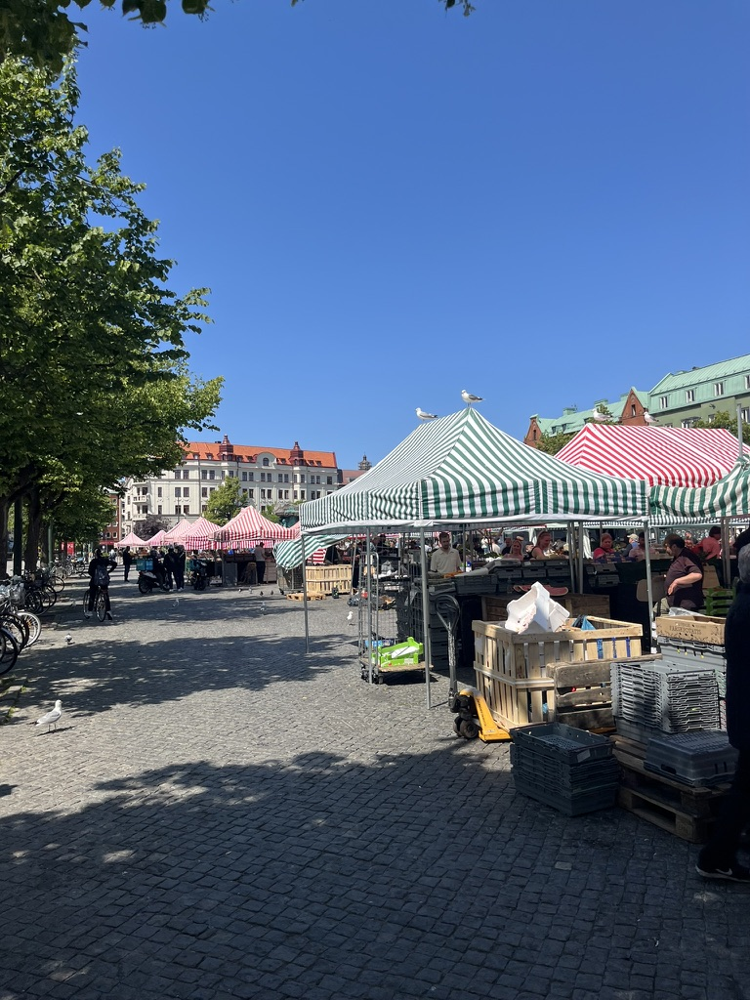
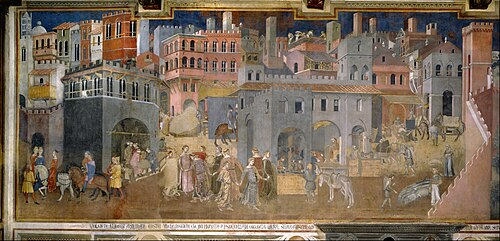
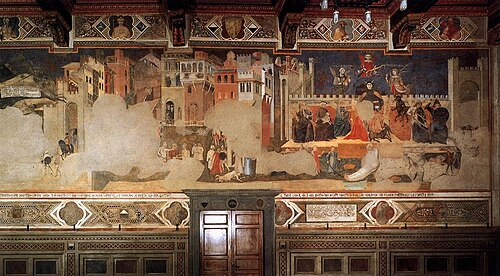
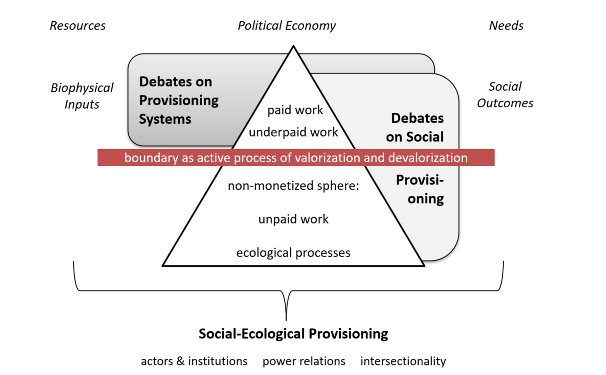
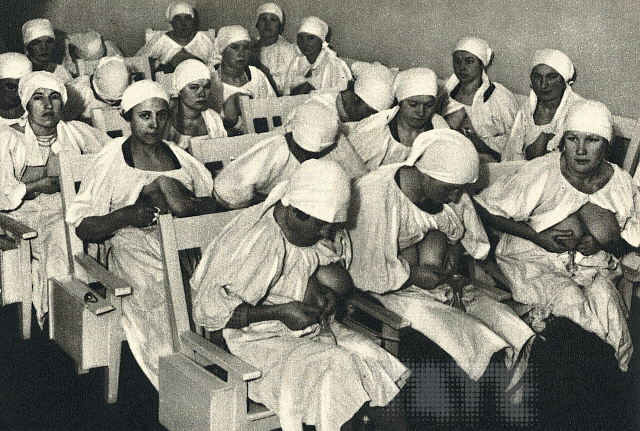
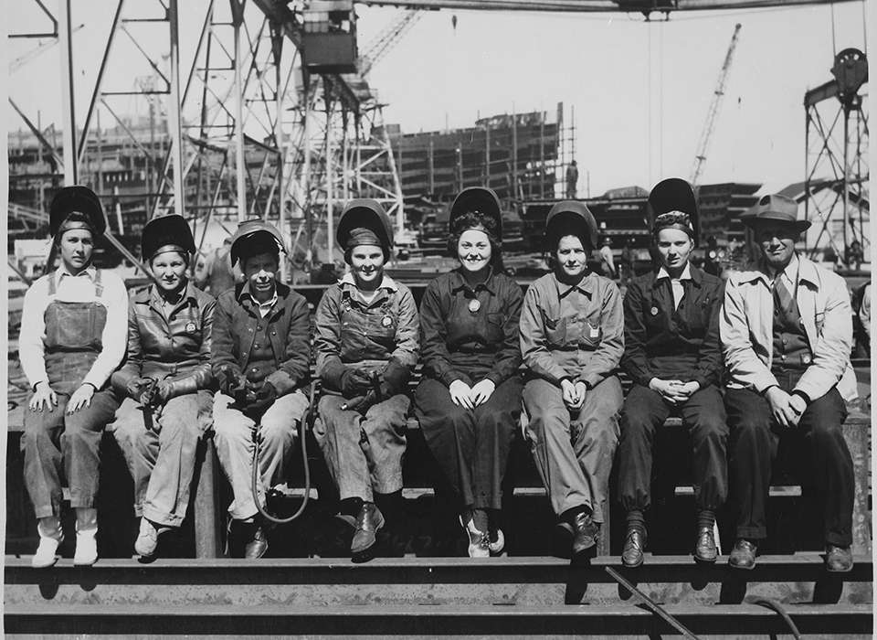

# Learning Objectives

::: {.callout-tip}
## By the end of today's lecture you should be able to:
1. Explain Polanyi's distinction between real and fictitious commodities and what it implies for the limits of self-regulating markets
2. Describe the double movement and identify contemporary examples
3. Articulate the ecofeminist critique that mainstream economics renders unpaid care work and ecosystem functions invisible
4. Apply an intersectional lens to a provisioning system (e.g., healthcare) and identify whose labor sustains it
:::

# Part I: Markets and Embeddedness {.inverted}

## What is a market?

{.center}

:::{.notes}
Polanyi's empirical definition vs. the mainstream abstraction "The Market"

 The mainstream taxonomy

Output markets (real commodities) / Factor markets (labor, land, money)

Polanyi's move: fictitious commodities

Labor, land, money were not produced for sale—the commodity description is a fiction
:::

## Commodities

> a substance or product that can be traded, bought, or sold

[[Cambridge Dictionary](https://dictionary.cambridge.org/us/dictionary/english/commodity)]{.slide-cite}

## The double movement

{.fragment}

:::{.notes}
**First movement**: the expansion of the self-regulating market. The push, backed by economic liberalism, to organize all economic life — labor, land, and money included — as commodities trading on price-setting markets. In 19th-century Britain this took concrete institutional form: the New Poor Law (1834) created a labor market by stripping subsistence guarantees; enclosure and land registration commodified land; the gold standard subordinated money to international market discipline; free trade dismantled domestic protections.

**Second movement:** society's protective counter-reaction. Spontaneous, defensive measures by which society shields itself from the destructive effects of treating labor, land, and money as ordinary commodities. Factory Acts, trade union rights, public health legislation, agricultural tariffs, central banking, social insurance. Polanyi insists this isn't ideological or coordinated — it's society protecting its own substance from being annihilated.
Three features students usually need help seeing:
The counter-movement is heterogeneous. Workers demand labor protection, landowners demand agricultural tariffs, central bankers demand monetary discipline. Conflicting interests, but a shared structural position as those being damaged by — or trying to contain — unfettered markets. It's not a coalition.
The counter-movement is not necessarily progressive. This is the part most often softened in teaching. Polanyi argues that fascism in the 1930s was a form of the protective counter-movement — society reaching for authoritarian solutions after democratic ones failed to contain the breakdown of the gold-standard order. The double movement is a structural diagnosis, not a hopeful one. The New Deal, Soviet socialism, and fascism are all on the same analytic shelf for Polanyi: divergent answers to the same crisis.
The whole thing is rooted in the fictitious commodities argument. If labor, land, and money really were commodities, no counter-movement would be needed. They are not, so it is.
:::

## The Rise of Market Economies in Italy in the Middle Ages (1000~1300) [@vanbavel2016MarketsMedievalCityStates]

:::{.notes}
present-day Lombardy, Liguria, Emilia Romagna, Tuscany,  Umbria, the Marches, and the Veneto.
“Florence, Venice, Genoa, and Milan  saw the number of their inhabitants grow sharply.”

“Alongside these product and commodity  markets, markets for land, leases, labour, and capital, after their emergence in  the eleventh century, also grew, especially in the twelfth and thirteenth  centuries, as we will see.”

Northern and central Italian communes were where land, labor, and capital first became broadly tradable in post-Roman Europe: alienable property in land, common wage labor, sophisticated credit and partnership instruments (the commenda, public debt via the Monte). Factor markets, in other words. The initial phase (~1100–1300) was relatively egalitarian: peasants had bargaining power, guild members had protections, communal citizenship was broad. Prosperity followed and was widely shared.
:::

## Happily ever after?

“Instead of leading to ever more open exchange and equal opportunities, [markets in the longer run had adverse effects]{.fragment .highlight-blue}. As will be shown in this section, [both the context in which these markets functioned and their organization]{.fragment .highlight-blue} started to change and became more unbalanced and skewed towards the interests of the elite, especially in the fourteenth century.” [@vanbavel2016MarketsMedievalCityStates p. 15]

## The Decline of Market Economies in Italy in the Middle Ages (~1300-1500) [@vanbavel2016MarketsMedievalCityStates]

:::{.notes}
From the late 1300s the same factor markets allowed wealth concentration. Alfani's data, which van Bavel relies on heavily, shows the top wealth shares rising sharply through the 14th–15th centuries. The wealthy then captured political institutions (the Venetian Serrata in 1297; the Florentine patriciate consolidating around the Medici), and used political power to rig the markets — restricting guild entry, suppressing labor, enforcing debt aggressively, awarding monopolies.

By the 1500s the Italian elite were rentiers, not investors: government bonds, real estate, sinecures. Productive innovation dried up. Northwest Europe overtook Italy and never gave the lead back. Van Bavel's point: the very factor markets that drove the rise produced the inequality that produced the political capture that produced the stagnation. The market did not correct itself; it ossified.

“The blossoming of the Renaissance is thus only in  part a sign of economic growth. In another respect it is rather the sign of the  decadence of a preceding period of growth: the fruit of autumn”
:::

# Part II: Ecofeminist Perspectives {.inverted}

:::{.notes}
**Synthesis: markets as embedded institutions**
Embeddedness is empirical, not normative—the question is *how* and *with what costs*

**What else does the mainstream abstraction render invisible?**
Polanyi: labor and land. Ecofeminism: care and ecosystems.
:::

## Employment is a subset of work

:::{.notes}

draw the iceberg

ILO broadened definition in 2013

**The monetization boundary is contested**
Fraser's "boundary struggles" — not a fixed line, but a power-laden process
:::

## The Motherhood Penalty in Sweden

![Impact of children on labor market outcomes copied from @sundberg2024ChildPenaltySweden [p. 11]](../assets//motherhood-penalty.png){#fig-motherhood-penalty}

## The Marketization of Motherhood and Care

::: {.columns}

::: {.column}

{#fig-wet-nurses}

:::

::: {.column .fragment}

{#fig-surrogacy}

:::

:::

## Power struggle over monetized labor

:::{.r-stack}
{#fig-ww2-women}

{#fig-good-housewive .fragment}
:::

***

### Bargaining Positions



[Institute for New Economic Thinking’s “Feminist Economics”](https://www.ineteconomics.org/perspectives/videos/feminist-economics)

## Zooming in on Intersectionality in Sweden

{.center}

:::{.notes}
Housewifization (von Werlhof 1988):

“in other words the devaluation of paid care work due to its association with women’s unpaid household labor, transfers this disdain for everything connected to unpaid and highly gendered care work”
:::

## Rot- och Rutavdrag

När du anlitar ett företag för reparation, underhåll, ombyggnad eller tillbyggnad kan du få rotavdrag för delar av arbetskostnaden. [Du kan också få rutavdrag för hushållsnära tjänster som städning och trädgårdsarbete]{.highlight-blue}. Material och andra kostnader, som resekostnader, ger däremot inte rätt till avdrag.

##

::: {.r-fit}
> ... strategies that strengthen non-monetized social-ecological provisioning [without monetizing it]{.highlight-blue}, thereby questioning the arbitrariness of what is (un-/under-)paid in capitalist economies. @dengler2024ForegroundingInvisibleFoundations [p. 1]
:::

***
### Time Politics

:::{.notes}

**Draw clock.**

Frigga Haug's Vier-in-Einem-Perspektive (2008) is a feminist proposal for how time should be distributed across human activity. The claim: in a good society, every adult would spend roughly equal hours — about four per day, given ~16 waking hours — on four spheres:

Paid work — wage labor for material reproduction
Care work — household, child-rearing, caring for the elderly and sick
Political activity — democratic participation, civic life
Self-development — learning, art, leisure, contemplation

Her argument is that current arrangements grossly distort this distribution: wage labor dominates in its full-time form (and is gendered male), care work is privatized and feminized, political life is hollowed out, and self-development is residual. The result is that no one — neither women carrying the care burden nor men in full-time paid work — gets a fully rounded human life.
:::

***

### Decouple livelihoods from employment: UBI and UBS

[**U**]{.hihglight-blue}niversal **B**asic **I**ncome

[**U**]{.hihglight-blue}niversal **B**asic **S**ervices

# Checking in on Learning Objectives

::: {.callout-tip}
## By the end of today's lecture you should be able to:
1. Explain Polanyi's distinction between real and fictitious commodities and what it implies for the limits of self-regulating markets
2. Describe the double movement and identify contemporary examples
3. Articulate the ecofeminist critique that mainstream economics renders unpaid care work and ecosystem functions invisible
4. Apply an intersectional lens to a provisioning system (e.g., healthcare) and identify whose labor sustains it
:::

## References
