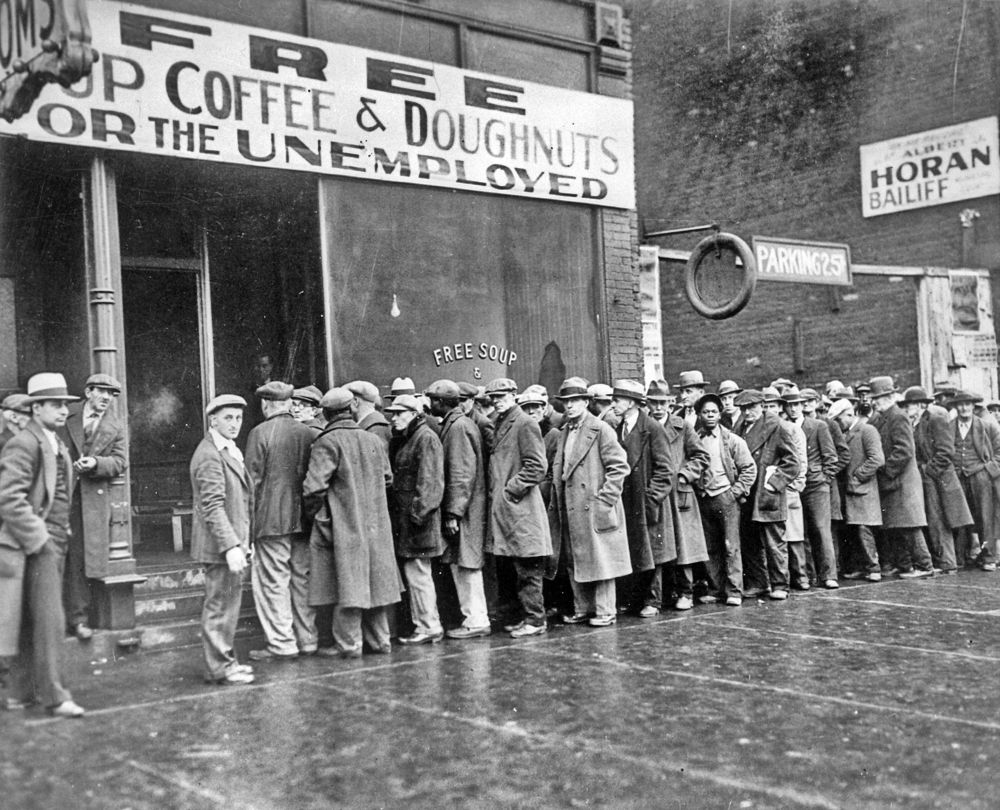
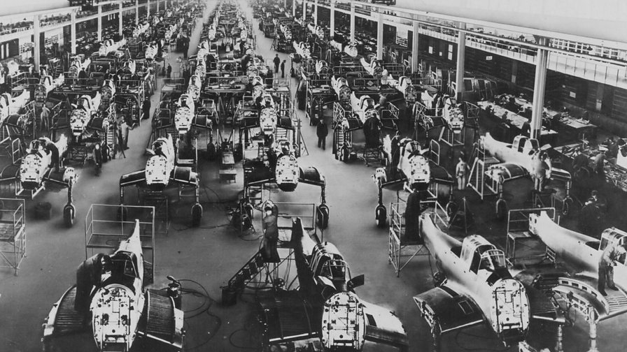
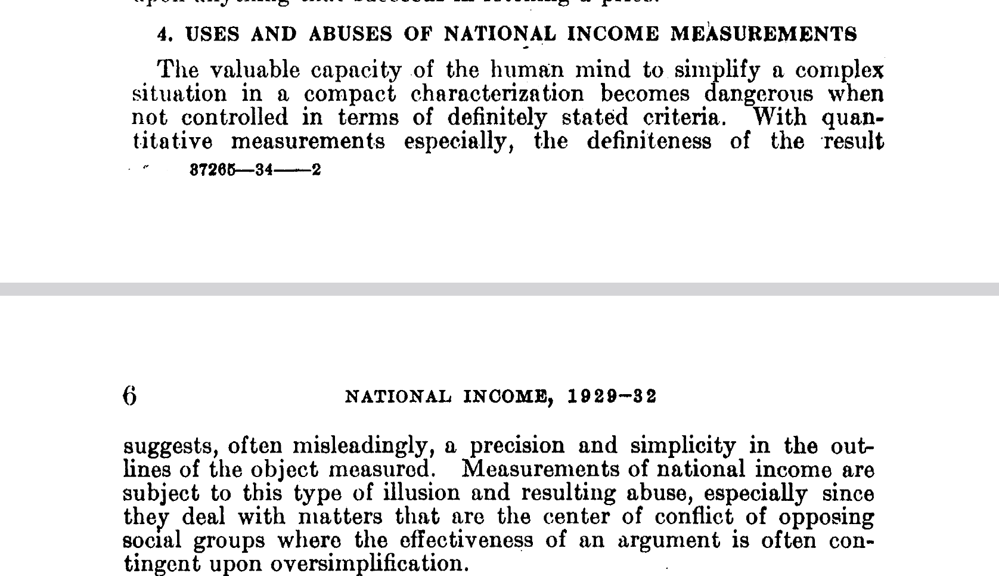
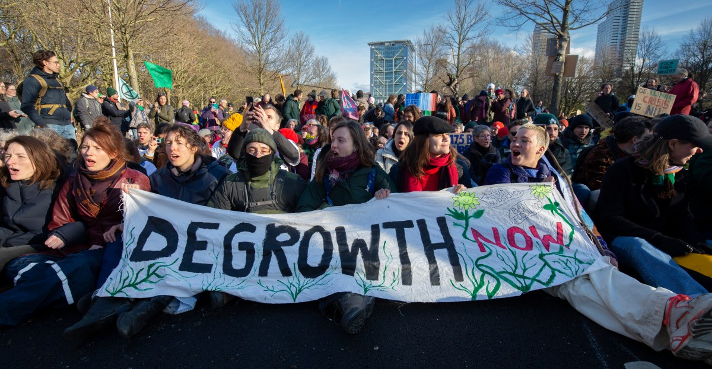
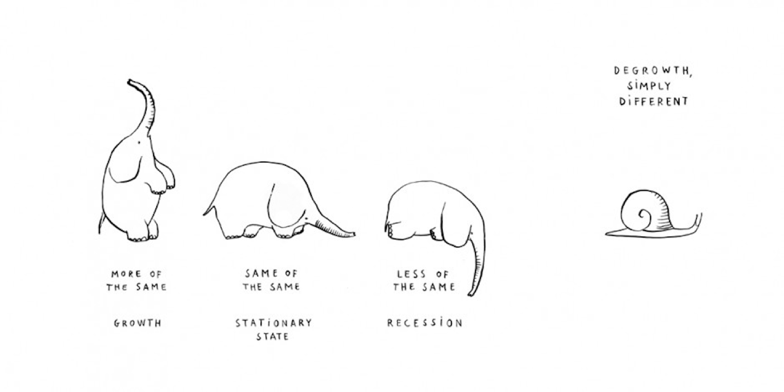

# Learning Objectives

::: {.callout-tip}
## By the end of today's lecture you should be able to:
1. Explain how GDP is measured in practice and identify what its production boundary includes and excludes
2. Evaluate the empirical case for green growth, including the limits of the Environmental Kuznets Curve
3. Define degrowth as a slogan, an interpretative frame, and a field of research, and distinguish it from recession
4. Outline the main strategies and policy proposals associated with degrowth and articulate at least one open question
:::

# Growth {.inverted}

## Economic Development versus Growth

::: notes
**Talking points:**

- The conflation of the two is the central rhetorical move of mid-twentieth-century economics. "Economic development" came to mean "more GDP per capita". Sen, Stiglitz, and Fitoussi all spent careers prying these apart.
- Note for students: in Swedish public discourse "tillväxt" is also slippery. The same elision is at work.
- We will spend the next twenty minutes asking what exactly we are measuring when we measure "growth".

:::

## The Engine Room: Where Does GDP Come From?

::: {.columns}

::: {.column width="30%"}

{#fig-kuznets}

:::

::: {.column width="70%"}

::: {.r-stack}

{.fragment .fade-in-then-out width="80%"}

{.fragment width="80%"}

:::

:::

:::

::: notes
**This slide is a setup. Title-only. Begin the historical framing aloud.**

GDP did not fall from the sky. It was built --- by Simon Kuznets at the US National Bureau of Economic Research, on commission from the Department of Commerce, beginning in 1932. The first national accounts went to Congress in 1934.

- **1934**: Kuznets delivers *National Income 1929--1932* to Congress. The Great Depression makes the urgency obvious — policymakers had been flying blind.
- **1937--1944**: System extended for war economy planning. The Pentagon needed to know what the productive capacity of the United States actually was. GDP was a war-planning tool before it was a welfare tool.
- **1944, Bretton Woods**: The new international institutions (IMF, World Bank) adopt GDP-style accounting as the common metric.
- **1953**: First UN System of National Accounts (SNA). Universal.
- **1961**: The OECD treaty enshrines "highest sustainable economic growth" as the goal of member states.

GDP was designed for *one* job (planning aggregate production in a crisis or war), and was then quietly promoted to do a very different job (measuring the welfare and progress of nations). 
:::

## "Not a Measure of Welfare"

[@kuznets1934national]{.slide-cite}

::: notes
This is from the very first national income report Kuznets delivered to Congress, in 1934. The man who built the thing told the government, in the same document, that it should not be used the way it was about to be used.

**Optional addition if time permits:** the Robert F. Kennedy 1968 speech at the University of Kansas. "Our Gross National Product...measures everything, in short, except that which makes life worthwhile."
:::

## How GDP Is Measured

::: notes
1. **Production approach.** Sum the value added at each stage of production. Value added = output minus intermediate inputs. Avoids double-counting.
2. **Expenditure approach.** Sum final demand: $\text{GDP} = C + I + G + (X - M)$. Consumption, investment, government, net exports. This is what most students have heard of.
3. **Income approach.** Sum the incomes generated in production: wages, profits, rents, indirect taxes net of subsidies, depreciation.

In a closed accounting system, all three sum to the same number. This is not an empirical claim — it is a definition. The system is built to balance.

Two things to flag:

- The three views correspond to three things people care about: what we *make*, what we *buy*, what we *earn*. 
:::

## A Toy Economy

| Transaction | Amount |
|---|---:|
| Farmer sells wheat to Miller | 300 |
| Miller sells flour to Bakery | 600 |
| Bakery sells bread to Households | 1000 |
| Farmer pays wages | 250 |
| Miller pays wages | 200 |
| Bakery pays wages | 350 |

Assume no imports, no taxes, no investment, no inventory change.

::: notes
**Setup (write on board):**

A two-period closed economy with three firms and two households. All values in euros.

| Transaction | Amount |
|---|---:|
| Farmer sells wheat to Miller | 300 |
| Miller sells flour to Bakery | 600 |
| Bakery sells bread to Households | 1000 |
| Farmer pays wages | 250 |
| Miller pays wages | 200 |
| Bakery pays wages | 350 |

Assume no imports, no taxes, no investment, no inventory change.

**Round 1 (5 min): students compute GDP three ways, in pairs.**

- Production / value added: Bakery 1000-600 = 400. Miller 600-300 = 300. Farmer 300-0 = 300. Sum = **1000**.
- Expenditure: Household final consumption = **1000**. (The intermediate sales are not final.)
- Income: Wages 250+200+350 = 800. Profits = 1000 - 800 = 200. Sum = **1000**.

**FAQ:**

- *Why doesn't the system count environmental damage?* Because damage is not a transaction. SNA records transactions.
- *Aren't there alternative measures?* Yes — ISEW, GPI, HDI, Bhutan's GNH, the OECD Better Life Index, the Stiglitz-Sen-Fitoussi report. They have political traction in inverse proportion to their methodological complexity.

If a group finishes early, hand them this provocation: *In what direction would your toy economy need to be modified for GDP to fall while well-being rises?* Then we move on.
:::

## A Toy Economy continued

:::{.incremental}
1. **The baker's mother bakes bread at home and gives it to neighbors.** 
   - GDP: unchanged. The activity does not cross the market and is outside the production boundary. 
2. **Half of the bread is wasted in households after they purchase it from the bakery**
   - GDP: *unchanged*. Production happened; sale happened. The fact that the bread was wasted is invisible to GDP.
3. **The bakery's oven pollutes a river. A factory downstream installs a filter for €200.** 
   - GDP: *increases by €200*. 
4. **A storm destroys half the wheat crop. Insurance pays out and reconstruction begins.** 
   - GDP: *increases*. Disasters increase GDP in the short run.
5. **The farmer's land erodes 5% over the year.** 
    - GDP: *unchanged*. Natural capital depreciation is not in standard national accounting.
:::

## Can Growth Go Green?

:::{.fragment}
![Empiricial Data on EKC in Sweden from @lindmark2002EKCpatternHistoricalPerspective [p. 340]](../assets/lindmark-ekc-sweden.png){#fig-sweden-ekc width=80%}
:::

::: notes
The standard mainstream answer to the GDP critique is *not* "abandon GDP". It is "grow until you can afford to fix it". This is the Environmental Kuznets Curve hypothesis.

**Draw the EKC on the board**

- Horizontal axis: GDP per capita
- Vertical axis: pollution / environmental degradation
- Curve: inverted U-shape. Pollution rises with income at low levels of development, peaks at some "turning point", then falls.

The intuition: poor countries pollute because they cannot afford not to. Once incomes rise, citizens demand environmental protection and societies can afford it. The market, with a bit of regulatory help, sorts the rest. Growth is therefore not the problem but the solution.

This argument was empirically grounded for some local pollutants in OECD countries in the 1980s and 1990s — sulfur dioxide, particulates, lead. It got grandfathered into textbooks. It is the intellectual backbone of "green growth" policy at the OECD, the World Bank, and the European Commission's Green Deal.
:::

# Degrowth {.inverted}

## Not a Crash. Not a Recession.

::: {.columns}

::: {.column width="50%"}
### Recession

{#fig-depression width=80%}

Unintended.

GDP contracts; everything else degrades with it: employment, services, ecological stress per unit output often *rises*.

A failure of the growth economy.
:::

::: {.column width="50%" .fragment}
### Degrowth

{#fig-degrowth-activsits}

Intended.

A planned, equitable downscaling of throughput, with employment, services, and ecological integrity *protected* in the transition.

An alternative [*to*]{.text-royal-blue-400} the growth economy.
:::

:::

::: notes

When critics of degrowth caricature the position, they almost always conflate it with recession. "You want us to be poorer?" "You want the 2008 financial crisis on purpose?" No. The 2008 recession was a *failure* of a growth-dependent system. Degrowth proposes a *redesign* of the system so that contraction in throughput does not produce that kind of human cost.
:::

## A Missile Word

> [Décroissance]{.fragment .highlight-blue} was launched by activists in 2001 as a challenge to growth.

[@demaria2013WhatDegrowthActivist p. 191]{.slide-cite}

::: notes

When you first heard the word "degrowth", what was your reaction? File the answers. We will return to them at the end.

**Etymology and history**

- *Décroissance* — French for "decrease" or "reduction". Coined as a serious political-economic term by André Gorz in 1972.
- 2001: the word reappears as an activist slogan in France in the journal *Silence*.
- 2002: Lyon billboard campaign for car-free cities, ad-free public spaces, food cooperatives. *Décroissance* becomes a frame.
- 2008: First International Degrowth Conference, Paris. The term gets translated into English as "degrowth" (other translations: *decrescita*, *decreixement*, *decrecimiento*).
- 2014: Leipzig conference; degrowth enters German-language debate.
- 2010s: academic consolidation. Demaria et al. 2013 (this paper) is one inflection point.

The "missile word" framing is Latouche's, picked up by Demaria. The idea is that the word is not a description but an act of disruption. It is designed to destabilize a consensus — the consensus that growth is good and more growth is better. Once destabilized, the conversation can be re-opened.
:::

## Slogan, Concept, Movement

{#fig-snail}

::: notes

1. **Slogan.** A provocation that re-politicizes a debate that mainstream politics has rendered technical. Cf. the post-political condition: questions that should be political (what kind of society do we want?) get reduced to questions of management (how do we maximize GDP and keep emissions within targets?). Degrowth refuses that reduction.

2. **Concept.** An object of academic study. There are now hundreds of peer-reviewed articles, dedicated journal issues, textbooks. Kallis 2018 in the *Annual Review of Environment and Resources* is the canonical statement. We will look at that figure in a moment.

3. **Movement.** A loose, transnational network of activists, scholars, and practitioners. Conferences in Paris, Barcelona, Venice, Montreal, Leipzig, Budapest, Malmö, Mexico City, Vienna, Manchester, The Hague. (Note Malmö --- right here at Lund-Malmö in 2018. Some students may have peripheral connections.)
:::

## Activist-Led Science

![Degrowth research themes [@kallis2018ResearchDegrowth p. 293]](../assets/degrowth-research.png){#fig-degrowth-research}

## A young field with a lot of teething issues [(my opinion!)]{.text-royal-blue-400}

![Historical Average Heights of Men [copied from @clark2010FarewellAlmsBrief]](../assets/historical_heights.png){#fig-historical-heights}

# From Critique to Program {.inverted}

## Four Proposed Strategies

::: {.columns}

::: {.column width=25%}

**Opposing**

:::

::: {.column width=25%}

**Practicing**

:::

::: {.column width=25%}

**Reforming**

:::

::: {.column width=25%}

**Communicating**

:::

:::

::: notes
Demaria et al. 2013 identify three strategies in the degrowth movement (Section V):

1. **Oppositional activism.** Stop the bad stuff. Highway expansions, airport extensions, high-speed rail, lignite mines. Civil disobedience, direct action, blockades. The Ende Gelände actions in Germany are the textbook case.
2. **Building of alternatives.** Make the new stuff. Cooperatives, ecovillages, local currencies, transition towns, community-supported agriculture, repair cafés. The Catalan Integral Cooperative (CIC) — also from Demaria — is a good concrete reference.
3. **Political proposals (reformism).** Change the rules. Working time reduction legislation, basic income, basic services, financial regulation, tax reform. Working within existing institutions while pushing them.

Barlow et al. 2022 update this to four strategies, building on Erik Olin Wright's typology:

1. **Opposing** (= oppositional activism; Wright's ruptural)
2. **Practicing** (= building alternatives; Wright's interstitial)
3. **Reforming** (= political proposals; Wright's symbiotic)
4. **Communicating** — added by Barlow et al. Research, journalism, framing, public engagement. They argue degrowth has centered most of its energy here.

The fourth category is worth examining. Communication-heavy strategies have one obvious risk: they convert urgency into discourse. The degrowth movement has been criticized internally for being long on writing and short on action. Eversberg and Schmelzer 2018 surveyed the movement and found genuine tensions between currents that prioritize each of these four strategies.

**Pedagogical claim:** none of these four works alone. Ende Gelände without alternative coal phase-out plans is sabotage. Cooperatives without political reform stay marginal. Reform without protest gets co-opted. Communication without the other three is academic theatre.

Source: @demaria2013WhatDegrowthActivist Section V; @barlow2022DegrowthStrategyHow Ch. 2; 
*Envisioning Real Utopias*.
:::

## Some Policy Proposals

:::{.incremental}

- **Working time reduction.**
- **Universal basic income or universal basic services.** 
- **Maximum and minimum income ratios.** 
- **Job guarantee in care, repair, and ecological restoration sectors.** 
- **Carbon and resource caps with shrinking allowances.** 
- **Financial sector restructuring.** 
- **Commons-based provisioning.** 

:::

::: notes

A non-exhaustive list of policies that appear repeatedly in the degrowth literature. None of these is specific to degrowth — that is the point. Several are mainstream social-democratic ideas, repurposed.

- **Working time reduction.** Four-day week, 30-hour week, sabbaticals. Productivity gains taken as time, not output. Empirical evidence from Iceland, Belgium, recent UK trials.
- **Universal basic income or universal basic services.** Decouple subsistence from wage labor. UBI proposed by Atkinson, van Parijs; UBS proposed by Coote and colleagues at the New Economics Foundation. Debate within degrowth about which is preferable (cash vs. provisioning).
- **Maximum and minimum income ratios.** Cap inequality. Proposed ratios range from 5:1 (Mondragon cooperative) to 20:1. The exact number matters less than the principle.
- **Job guarantee in care, repair, and ecological restoration sectors.** Public employment in low-throughput, high-welfare activities.
- **Carbon and resource caps with shrinking allowances.** Hard biophysical limits. Cap-and-trade is one mechanism; quotas are another.
- **Financial sector restructuring.** Debt jubilee, full-reserve banking, public banks, restrictions on speculative finance. The growth imperative is partly enforced by the structure of debt-based money.
- **Commons-based provisioning.** Public housing, public transport, public childcare, knowledge commons. Decommodify what does not need to be a market.
- **Trade reform.** Address the offshoring problem flagged in the EKC critique. Consumption-based accounting, border adjustments, restrictions on extractive trade.

:::

## Open Questions

::: notes

1. **The Global South problem.** Degrowth, as a research program, has been developed largely in and for the wealthy global North. Many Southern voices — Lang 2017 is the standard reference — argue that the term does not travel well: countries that have been forcibly de-developed do not want to "degrow", they want self-determination and material sufficiency. Alternatives: *Buen Vivir* (Andean), *Ubuntu* (Southern African), *Swaraj* (Indian), *Eco-Swaraj*. Degrowth's relationship to these is, charitably, still being worked out.
2. **The employment and welfare-state problem.** Modern welfare states are funded by growth-derived tax revenue. Job markets clear, in part, through growth-driven demand expansion. A serious degrowth transition requires either (a) very fast structural transformation of the welfare state, or (b) acceptance of severe transitional unemployment, or (c) a different fiscal architecture entirely. 
3. **The political feasibility problem.** Degrowth proposes a major institutional reconfiguration in a political climate that has, over forty years, moved in the opposite direction. The strategic question — how does this happen politically, in democracies, in time — has no clean answer. 
:::

## Visioning Exercise: A Day in 2050

::: {.callout-tip}
## Group exercise 

Form pairs. Pick **one** of these domains:

- Work --- Food --- Mobility --- Housing --- Care --- Leisure

Imagine your everyday life in this domain in a degrowth society in **2050**.

What is different? What is the same? What is gained? What is lost?
:::

## Checking In on Learning Objectives

::: {.callout-tip}
## By the end of today's lecture you should be able to:
1. Explain how GDP is measured in practice and identify what its production boundary includes and excludes
2. Evaluate the empirical case for green growth, including the limits of the Environmental Kuznets Curve
3. Define degrowth as a slogan, an interpretative frame, and a field of research, and distinguish it from recession
4. Outline the main strategies and policy proposals associated with degrowth and articulate at least one open question
:::

## References

::: {#refs}
:::
