# Learning Objectives

::: {.callout-tip}
## By the end of today's lecture you should be able to:
1. Be able to contrast the concepts bioeconomy and bioeconomics
2. Know the most important sources of biomass and their limitations
3. Describe the role of innovation in the bioeconomy transition
4. Critically evaluate sustainability claims made about the bioeconomy
:::

# What is the bioeconomy?

:::{.notes}
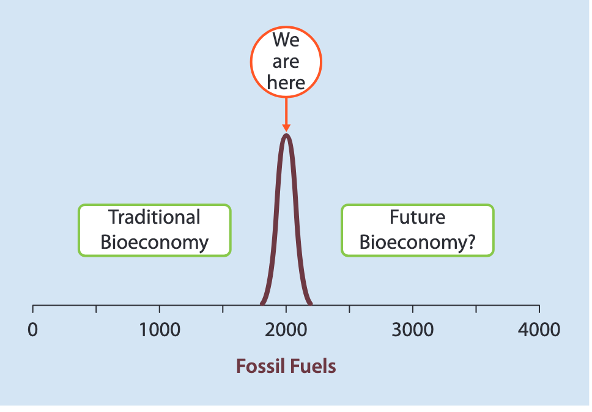
:::

## Co-opting @georgescu-roegen1975EnergyEconomicMyths's bioeconomics

## Bioeconomy visions

::: {.columns}
::: {.column width="33%"}

### [Bioresource]{.text-batlow-darkgreen}

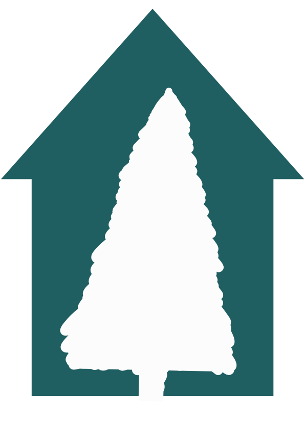
:::
::: {.column width="33%"}

### [Biotechnology]{.text-batlow-forestgreen}

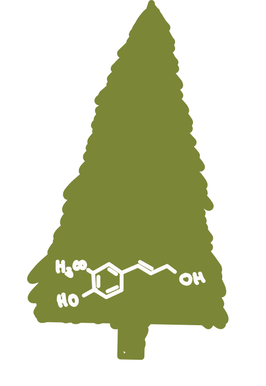

:::
::: {.column width="33%"}

### [Bioecology]{.text-batlow-darkblue}

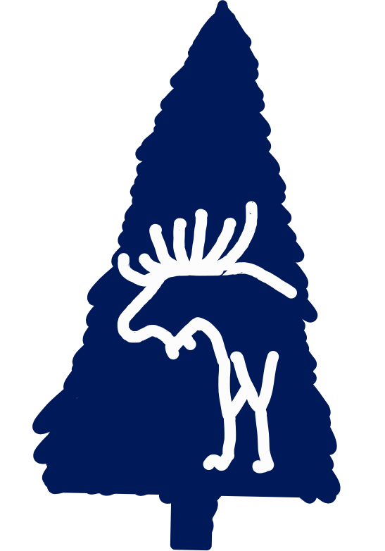

:::
:::

Classification based on @bugge2016WhatBioeconomyReview and @vivien2019HijackingBioeconomy

# Innovation and Change {.inverted}

## Definition of innovation

> “[An innovation is a ]{.text-default}[new or improved product or process (or combination thereof)]{.text-primary} [that differs significantly from the unit’s previous products or processes and that has been ]{.text-default}[made available to potential users (product) or brought into use by the unit (process).]{.text-primary}”

@oecd2018OsloManual2018 [p. 20]

## Kondratieff Cycles

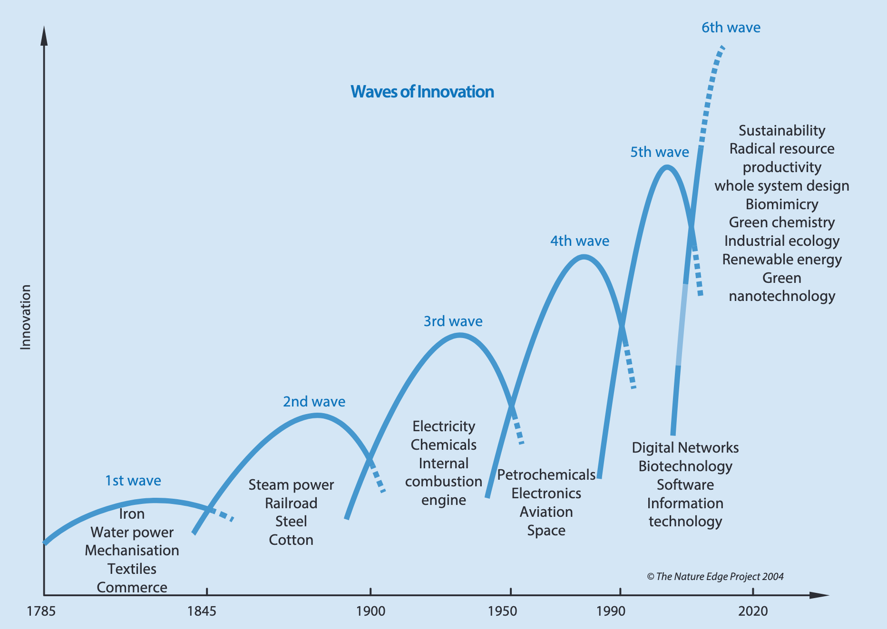{#fig-kondratieff}

:::{.notes}

:::

## Swedish forest-based bioeconomy innovations

![Counts of innovation classification by Bioeconomy Vision Category [@kreutzer2026ConsolidatingRatherGuiding]](../assets/fig_bioeconomy_vision_counts.svg){#fig-bioeconomy-trends}

# The political economy of bioeconomies {.inverted}

## Sources of biomass

::: {.columns}
::: {.column width="25%"}
**Agriculture**

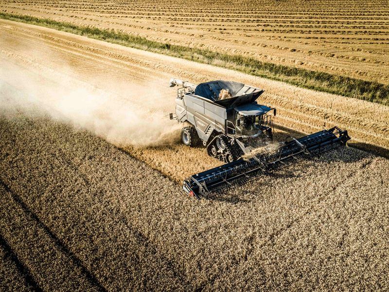{.cropped}
:::
::: {.column width="25%"}
**Forestry**

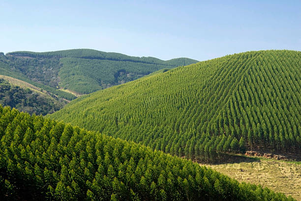{.cropped}
:::
::: {.column width="25%"}
**Aquaculture**

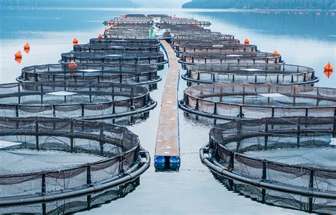{.cropped}
:::
::: {.column width="25%"}
**Waste**

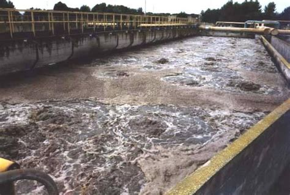{.cropped}
:::
:::

## Global North-South Dynamics

::: {.columns}

::: {.column width="50%"}

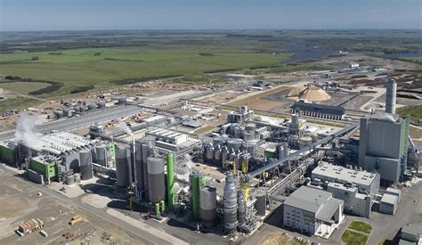{#fig-paso-toros width="650px"}

:::

::: {.column width="50%"}

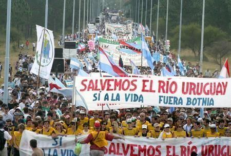{#fig-uruguay-protest}

:::

:::

## Alternative low-intensity uses

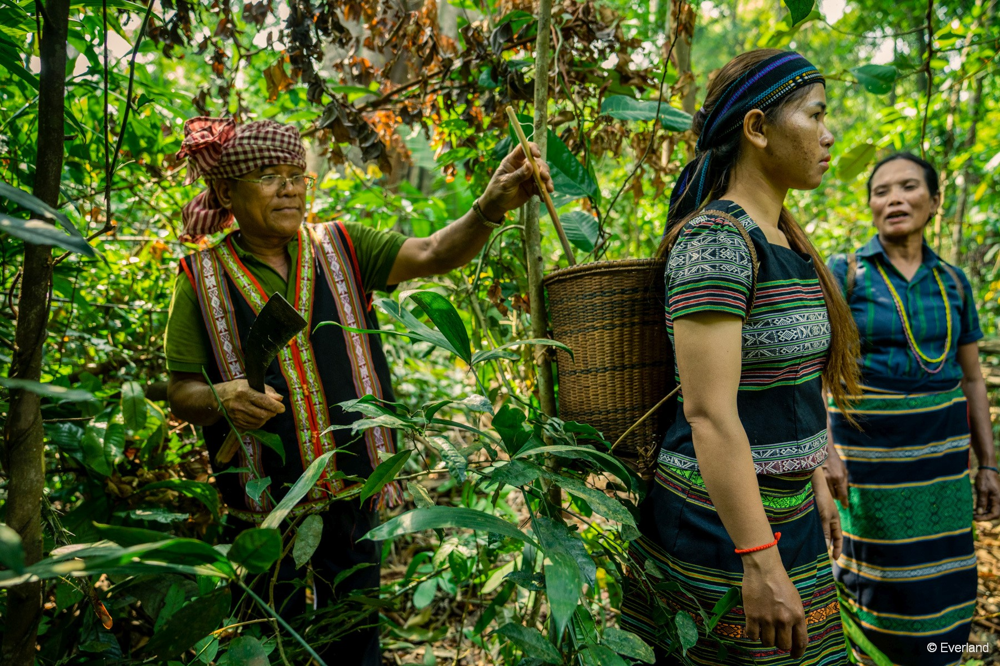{#fig-nftp}

## Checking in on Learning Objectives

::: {.callout-tip}

## By the end of this course you should:

Demonstrate the ability to independently apply anthropological, historical, sociological, and [economic perspectives]{.text-royal-blue-400} to environmental issues,

- demonstrate the ability to convey in-depth knowledge of human ecology in both spoken and written communication,

- demonstrate the ability to conduct subject-related information searches, evaluate information, and master reference management.

- demonstrate the ability to engage in informed discussion of the relationship between environmental problems and economic growth,

:::

## References

